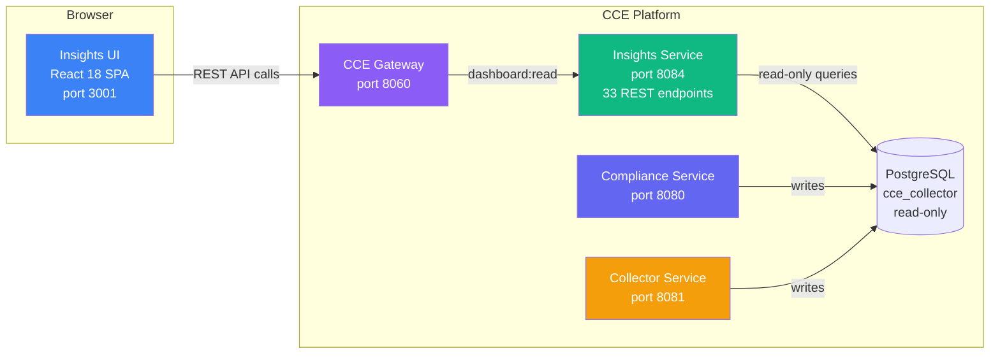
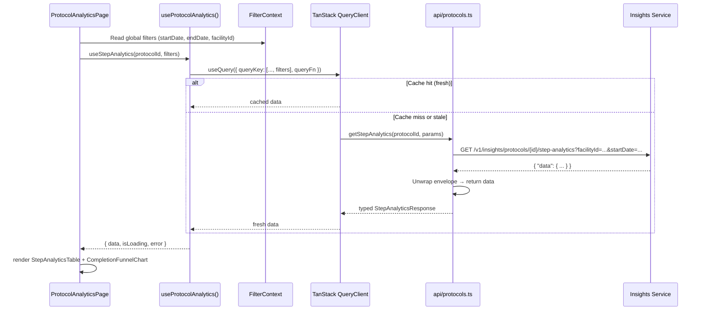
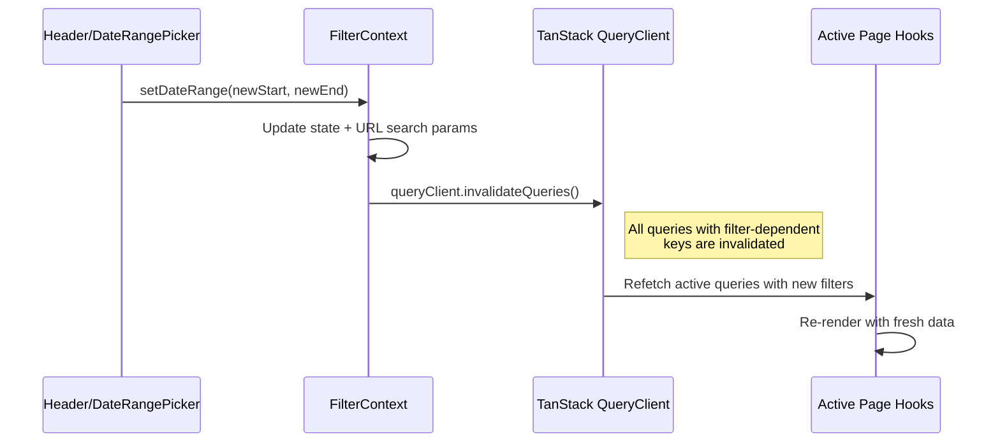

# Architecture Overview

> **CCE Insights UI** — Analytics dashboard for compliance intelligence  
> **Version**: 1.0.0 | **Last Updated**: 2026-06-30

---

## Table of Contents

1. [System Context](#1-system-context)
2. [Technology Stack](#2-technology-stack)
3. [Application Architecture](#3-application-architecture)
4. [Page & Component Hierarchy](#4-page--component-hierarchy)
5. [Data Flow](#5-data-flow)
6. [State Management](#6-state-management)
7. [Routing](#7-routing)
8. [Styling System](#8-styling-system)
9. [Error Handling](#9-error-handling)
10. [Performance](#10-performance)
11. [Deployment](#11-deployment)

---

## 1. System Context

The Insights UI is a **read-only** React SPA that visualizes compliance analytics by consuming the CCE Insights Service REST endpoints. It provides protocol adherence dashboards, deviation trend analysis, event volume metrics, facility leaderboards, practitioner analytics, intelligence delivery monitoring, and ingestion pipeline monitoring. Compliance categories are binary: **Compliant** (`on_track`) and **Non-Compliant** (`non_compliant`).



### Demo Mode Flow (No Gateway)

```
Browser (port 3001) ──REST──▶ Caddy (reverse proxy) ──▶ Insights Service (port 8084) ──▶ PostgreSQL (read-only)
```

In Docker, Caddy serves the SPA and proxies `/v1/insights/*` requests directly to `cce-insights-service:8084` on the shared Docker network.

### Production Flow (With Gateway + Keycloak)

```
Browser ──login (OIDC + PKCE)──▶ Keycloak ──issues JWT──▶ Browser
Browser ──REST + Bearer JWT──▶ Caddy ──▶ CCE Gateway (validates issuer/audience/INSIGHTS_READ)
       ──▶ Insights Service (port 8084) ──▶ PostgreSQL
```

The same image works gateway-less (no auth) or behind the gateway — controlled by the
`VITE_AUTH_ENABLED` build arg. See
[`artifacts/insights-ui-auth-deployment.md`](../artifacts/insights-ui-auth-deployment.md).

### Relationship to Compliance UI

| Concern | Compliance UI | Insights UI |
|---------|---------------|-------------|
| **Focus** | Individual patient journey demo | Aggregate analytics & operational intelligence |
| **Backend** | Compliance Service (port 8080) | Insights Service (port 8084) |
| **Port** | 3000 | 3001 |
| **Endpoints used** | ~12 (patient-centric) | 40+ (analytics + lookup) |
| **Primary users** | Demo audience, clinical staff | Operations managers, facility supervisors, data analysts |

---

## 2. Technology Stack

| Layer | Technology | Version | Purpose |
|-------|-----------|---------|---------|
| **Framework** | React | 18.x | Component-based UI |
| **Language** | TypeScript | 5.x | Type safety |
| **Build** | Vite | 6.x | Fast dev server, optimized builds |
| **Auth** | Keycloak (`keycloak-js`) | 26.x | OIDC Authorization Code + PKCE login (optional, build-time flag) |
| **Routing** | React Router | 7.x | Client-side page navigation |
| **Server State** | TanStack Query | 5.x | API data fetching, caching, polling |
| **Styling** | Tailwind CSS | 4.x | Utility-first CSS |
| **Icons** | Heroicons | 2.x | Consistent icon set |
| **Charts** | Recharts | 2.x | Bar, line, area, pie, funnel charts |
| **Dates** | date-fns | 4.x | Date formatting, diff calculation |
| **Testing** | Vitest + Testing Library | latest | Component + hook tests |
| **API Mocking** | MSW | 2.x | Mock Service Worker for tests |
| **Linting** | ESLint + Prettier | latest | Code quality |

### Why These Choices

- **Vite over CRA/Next.js**: SPA with no SSR needs; fastest dev server; minimal config
- **TanStack Query over Redux**: All data is server-owned; built-in polling, caching, stale-while-revalidate; no client mutations
- **Tailwind over component libraries**: Full design control; small bundle; consistent with Compliance UI
- **Recharts over D3**: Sufficient for analytics charts; D3 would be overkill; declarative API matches React patterns

---

## 3. Application Architecture

```mermaid
flowchart TD
    subgraph "Entry"
        main[main.tsx<br/>BrowserRouter + QueryClientProvider + FilterProvider<br/>initAuth then render]
        app[App.tsx<br/>Sidebar + Header + Routes]
    end

    subgraph "Pages (12)"
        P1[DashboardPage]
        P2[ComplianceOverviewPage]
        P3[ProtocolAnalyticsPage]
        P4[PatientListPage]
        P5[PatientDetailPage]
        P6[DeviationsPage]
        P7[EventVolumePage]
        P9[FacilityAnalyticsPage]
        P10[PractitionerAnalyticsPage]
        P11[IngestionPage]
        P12[IntelligencePage]
        P13[ExportsPage]
    end

    subgraph "Components"
        direction LR
        L[Layout<br/>Sidebar]
        C[Shared<br/>Card, MetricCard, StatusBadge,<br/>PageHeader, ErrorAlert,<br/>DateRangeFilter, FacilityFilter,<br/>CursorPagination, EmptyState,<br/>LoadingSpinner]
        CH[Charts<br/>10 chart components:<br/>trends, funnels, heatmaps]
    end

    subgraph "Data Layer"
        AUTH[Auth<br/>keycloak.ts<br/>OIDC + PKCE, token refresh]
        CTX[Context<br/>FilterContext]
        H[Hooks (13)<br/>useComplianceSummary, useDashboard,<br/>useDeviations, useIntelligence,<br/>usePractitioners, useFacilities, etc.]
        A[API Client (12 endpoint modules)<br/>compliance, dashboard, deviations,<br/>events, intelligence, practitioners,<br/>facilities, ingestion, lookups, etc.]
    end

    subgraph "Utilities"
        U[Utils<br/>dates, colors, formatters,<br/>compliance, pagination]
    end

    main --> app
    app --> L
    app --> CTX
    L --> P1 & P2 & P3 & P4 & P5 & P6 & P7 & P9 & P10 & P11 & P12 & P13
    P1 & P2 & P3 & P6 & P7 & P9 & P12 --> CH
    P1 & P2 & P3 & P4 & P5 & P6 & P7 & P9 & P10 & P11 & P12 & P13 --> C
    P1 & P2 & P3 & P4 & P5 & P6 & P7 & P9 & P10 & P11 & P12 & P13 --> H
    H --> A
    H --> CTX
    A --> AUTH
    CH --> U
    C --> U
```

### Layer Responsibilities

| Layer | Responsibility | Rule |
|-------|---------------|------|
| **Pages** | Route-level components; compose layout + data hooks + child components | One page per route; no direct `fetch` calls |
| **Components** | Visual rendering; receive data via props | Stateless where possible; no API calls |
| **Charts** | Recharts wrappers; receive processed data arrays | No data fetching; pure render |
| **Hooks** | TanStack Query wrappers; return `{ data, isLoading, error }` | One hook per API endpoint group; receive global filters from context |
| **API** | Typed `fetch` wrappers; URL construction, error parsing, envelope unwrapping (12 endpoint modules + `client.ts` + `types.ts`) | No React dependencies; pure TypeScript |
| **Auth** | `client.ts` injects `Authorization: Bearer <token>` where token = live Keycloak access token (`getToken()`) or `VITE_AUTH_TOKEN` fallback | Applied only when `authEnabled` (`VITE_AUTH_ENABLED==='true'`); `keycloak-js` runs Authorization Code + PKCE login on load |
| **Context** | Global filter state (date range, district, facility) shared across pages | Persisted in URL search params for shareability |
| **Utils** | Pure functions for formatting, computation, color mapping | No side effects |

### Authentication (`src/auth/keycloak.ts`)

Authentication is optional and controlled by a **build-time** flag, `VITE_AUTH_ENABLED` (Vite
inlines `VITE_*`; for the Docker image it is set via `--build-arg`). When the flag is `'true'`:

1. `initAuth()` runs in `main.tsx` **before** the app renders (`initAuth().then(render)`), so an
   unauthenticated user is redirected to Keycloak (`onLoad: 'login-required'`, `pkceMethod: 'S256'`).
2. The Keycloak base URL defaults to `${window.location.origin}/auth` (UI and Keycloak share a
   domain), overridable via `VITE_KEYCLOAK_URL`. Realm defaults to `cce`, client id to
   `cce-insights-ui`.
3. A background interval refreshes the access token (`keycloak.updateToken(70)` every 60s).
4. `client.ts` reads the live token via `getToken()` and sends it as `Authorization: Bearer …` on
   every API call; the gateway validates issuer, audience (`gateway-service`) and the
   `INSIGHTS_READ` role.
5. `App.tsx` renders a **Sign out** button in the header when `authEnabled`.

When the flag is `false` (local dev / gateway-less demo), the auth path is inert and the app runs
unauthenticated against the Vite proxy or a direct insights-service. See
[`artifacts/insights-ui-auth-deployment.md`](../artifacts/insights-ui-auth-deployment.md) for the
full Keycloak + gateway deployment procedure.

> **No runtime config.** There is no `window._env_` / entrypoint injection in this repo — all
> config is build-time `import.meta.env.VITE_*`. `src/config.ts` holds only UI constants.

---

## 4. Page & Component Hierarchy

```
App.tsx (Sidebar + Header + Routes; providers live in main.tsx)
├── Sidebar (MoH seal + "CCE Insights" / "MOH Digital Health" branding block, RI-67 — above a
│            flat nav list of 7 links)
├── Header (RI-67: blue government-style bar — MoH seal + "Republic of Rwanda" / "Care
│           Coordination Engine" on the left — carrying the global DistrictFilter + FacilityFilter
│           + DateRangeFilter + Sign-out button when authEnabled — RI-56: District/Facility render
│           on every page, no exceptions)
├── <Routes> (inline; pages are React.lazy + Suspense)
│
├── / → DashboardPage    (RI-38: high-level NATIONAL indicators only — each KpiCard links to its section)
│   ├── Service Compliance Rate  → /compliance            (context: compliant of tracked; health-coloured)
│   ├── Total Facilities         → /facilities            (context: active · inactive)
│   ├── eBuzima Adoption Rate    → /facilities             (context: actual vs expected, selected period)
│   ├── Referral Rate            → /compliance/patients    (placeholder 0% — definition pending)
│   └── Ingestion Rate           → /ingestion              (acceptance %)
│         (KpiCard: icon + value + context line + drill-in link; balanced 3-over-2 grid.
│          Detail breakdowns AND trend charts were moved to their own section pages — RI-38.)
│
├── /compliance → ComplianceOverviewPage
│   ├── ProtocolSelector (dropdown; facility scoping is via the global header filter, RI-56)
│   ├── ComplianceSummaryCards (Tracked / Compliant / Non-Compliant Patients, Compliance Rate)
│   ├── Transactions tiles (Total Steps, Completed, Due, Overdue, Missed, Pending)
│   └── Service Workflow Compliance (vertical timeline with collapsible sub-actions)
│
├── /compliance/protocols/:id → ProtocolAnalytics
│   ├── StepAnalyticsTable (per-step rates, timeliness, avg/median)
│   ├── CompletionFunnelChart (funnel — drop-off per step)
│   ├── OutcomeDistributionChart (pie — ACTIVE/COMPLETED/WITHDRAWN/EXPIRED)
│   └── EnrollmentTrendChart (line — enrollments over time)
│
├── /compliance/patients → PatientList
│   ├── Status filter (All / Compliant / Non-Compliant) + patient search
│   ├── Enrollment Date / Activity Date radio (dateFilterMode — local to this page)
│   └── PatientComplianceTable (page-size selector + range pagination)
│
├── /compliance/patients/:id → PatientDetail
│   ├── ProtocolTrackingCard × N ("Tracking Since")
│   ├── Protocol Journey timeline (legend; hides superseded steps; synthetic DEVIATION status)
│   ├── Step Details table (Action / State / Due / Completed / Source)
│   └── Right column: Deviations + Intelligence Alerts cards
│
├── /deviations → Deviations
│   ├── ProtocolFilter
│   ├── KPI cards × 4 (Total, Overdue, Missed, Order Violation)
│   ├── DeviationTrendChart (area)
│   ├── DeviationsByFacilityChart (RI-34 — stacked horizontal bar, ranked, paginated; type
│   │        toggle shares state with the KPI cards and the Deviation List's toggle below)
│   ├── Most Deviated Steps table (Total / Overdue / Missed / Order Violation)
│   └── Deviation List (type pills + patient search, page pagination)
│
├── /events → EventVolume
│   ├── KPI cards × 5 (Total Events, Matched Rate, Zero Match Rate, Duplicates, Pipeline Loss —
│   │        Total Events / Zero Match Rate are click-to-jump to their section below)
│   ├── EventTrendChart (stacked area by resource type)
│   ├── Tabs: By Resource Type (chart) | By Facility (table merged with facility
│   │        reference list — 0-event facilities included, scoped by district AND facility;
│   │        client-side pagination 10/page)
│   └── Zero-Match Events Info table (resource type / code / category / facility / count;
│            server-side scoped by district + facility + date range)
│
├── /facilities → FacilityAnalytics
│   ├── Facility activity cards × 3 (Total / Active / Inactive)
│   ├── FacilityHighlightsCard (Top 5 / Bottom 5 by compliance)
│   └── FacilityRankingCard (Rank-By pills + Best/Worst-First toggle;
│            color-coded compliance column with legend)
│
├── /practitioners → PractitionerAnalytics  (URL-only; not in sidebar)
│   ├── Metric tiles + Rank-By pills (Step Completion % / Patients Served) + search
│   └── Ranking table (Rank / Practitioner / Facility / Patients / Step Completion / Steps)
│
├── /intelligence → IntelligencePage  (URL-only; not in sidebar)
│   ├── ProtocolFilter + metric cards × 4 (Total Action Instances, Delivered, Failed, Pending)
│   ├── Success/Failure donut + Deliveries by Destination bars
│   ├── Active Adaptors & Routing table
│   └── Intelligence Actions table (# / Action / Trigger / Parent Step)
│
├── /ingestion → IngestionPipeline  (RI-56: now supports the global District filter too —
│   │        previously the only page without district support server-side)
│   ├── KPI tiles incl. "Last Ingested Event" (polled, uncached, not date-filtered — pipeline
│   │        freshness for the selected district/facility scope)
│   ├── IngestionFunnelChart (ACCEPTED/REJECTED/DUPLICATE)
│   ├── RejectionReasonChart (bar — by rejection reason)
│   ├── SourceQualityTable (per-source acceptance/rejection rates)
│   └── PipelineLossCard (lost events count & rate)
│
└── /exports → Exports  (URL-only; not in sidebar)
    ├── ExportConfigForm (format, protocol, facility, date range)
    └── DownloadButton
```

> **Sidebar vs routes:** the sidebar links to 7 pages (Dashboard, Facilities, Compliance,
> Deviations, Patients, Events, Ingestion — see §7). `Practitioners`, `Intelligence`,
> and `Exports` are valid routes but are reachable by direct URL only — they are not in the nav.
> (e-Buzima Adoption is no longer a page — its metrics live in the Facility Ranking.)

---

## 5. Data Flow

### 5.1 API Request Lifecycle



### 5.2 Global Filter Change Flow



> **Metric time semantics** — two clocks, chosen by metric type:
>
> - **Functional metrics** — clinical/business KPIs (adoption, compliance, deviations, event volume, referrals, patient cohorts). Measured on **clinical `event_time`**: when the clinical act actually happened. The global date filter scopes these by `event_time`.
> - **Technical / operational metrics** — the Ingestion page (pipeline health / throughput). Measured on **processing / system time** (`received_at`).
>
> Rule of thumb: every page filters by clinical `event_time` EXCEPT the Ingestion page, which is the sole system-time (technical) view.

### 5.3 Polling for Dashboard Updates

```typescript
useQuery({
  queryKey: ['events', 'summary', filters],
  queryFn: () => getEventSummary(filters),
  refetchInterval: POLLING_INTERVAL, // default 60s
});
```

---

## 6. State Management

| State Type | Tool | Examples |
|-----------|------|---------|
| **Server state** (API data) | TanStack Query | Compliance summaries, deviation trends, event volume |
| **URL state** | React Router + search params | Selected protocol, patient ID, pagination cursor |
| **Filter state** | React Context + URL params | Global date range, facility filter |
| **UI state** | React `useState` | Sidebar collapsed, selected tab, chart dimension |

### Query Key Strategy

```typescript
// Hierarchical keys incorporating global filters for automatic invalidation
['dashboard', 'overview', filters]
['dashboard', 'compliance-summary', filters]
['dashboard', 'referrals', filters]
['compliance', 'summary', protocolId || 'all', effectiveFilters]
['compliance', 'patients', protocolId, { status, patientId, limit, cursor, dateFilterMode }, filters]
['patients', patientId, 'timeline', { startDate, endDate }]
['patients', patientId, 'tracking']
['patients', patientId, 'tracking', protocolInstanceId]
['patients', patientId, 'events', { resourceType, source, limit }]
['patients', patientId, 'deviations', { deviationType, startDate, endDate }]
['patients', patientId, 'intelligence-deliveries']
['deviations', 'kpis', { protocolDefinitionId, ...filters }]
['deviations', 'trends', { interval, protocolDefinitionId, ...filters }]
['deviations', 'by-action', { protocolDefinitionId, deviationType, facilityId }]
['deviations', 'by-facility', { page, pageSize, deviationType, protocolDefinitionId, ...filters }]
['deviations', 'intelligence-summary', filters]
['intelligence', 'summary', { ...filters, protocolDefinitionId }]
['events', 'summary', { facilityId, source, startDate, endDate }]
['events', 'trends', { interval, resourceType, facilityId, source, startDate, endDate }]
['events', 'by-resource-type', { facilityId, source, startDate, endDate }]
['events', 'by-facility', { resourceType, startDate, endDate, ...filters }]
['events', 'kpis']
['protocols', protocolId, 'step-analytics', { facilityId, startDate, endDate }]
['protocols', protocolId, 'completion-funnel', { facilityId, startDate, endDate }]
['protocols', protocolId, 'outcome-distribution', { facilityId, startDate, endDate }]
['protocols', protocolId, 'enrollment-trends', { interval, facilityId, startDate, endDate }]
['facilities', 'ranking', rankBy, order, limit, filters]
['facilities', 'activity-summary', filters]
['facilities', 'reference']        // 1-hour staleTime
['facilities', 'adoption', filters]
['practitioners', 'ranking', { ...params, ...filters }]
['patients', 'at-risk-hotspots', { protocolDefinitionId, startDate, endDate }]
['patients', 'repeat-deviations', { minDeviations, facilityId, protocolDefinitionId }]
['ingestion', 'funnel', { facilityId, source, startDate, endDate, interval }]
['ingestion', 'rejections', { facilityId, source, startDate, endDate }]
['ingestion', 'source-quality', { facilityId, startDate, endDate }]
['ingestion', 'pipeline-loss', { facilityId, startDate, endDate }]
```

---

## 7. Routing

The `BrowserRouter` (with `basename={import.meta.env.VITE_ROUTER_BASE}` — `/` in dev, `/insights`
in the Docker image) wraps the app in `src/main.tsx`. `App.tsx` declares the routes inline:

```tsx
// src/App.tsx — uses Routes/Route from react-router-dom with lazy-loaded pages
<Routes>
  <Route path="/" element={<Dashboard />} />
  <Route path="/compliance" element={<ComplianceOverview />} />
  <Route path="/compliance/protocols/:id" element={<ProtocolAnalytics />} />
  <Route path="/compliance/patients" element={<PatientList />} />
  <Route path="/compliance/patients/:id" element={<PatientDetail />} />
  <Route path="/deviations" element={<Deviations />} />
  <Route path="/events" element={<EventVolume />} />
  <Route path="/facilities" element={<FacilityAnalytics />} />
  <Route path="/practitioners" element={<PractitionerAnalytics />} />
  <Route path="/ingestion" element={<IngestionPipeline />} />
  <Route path="/intelligence" element={<Intelligence />} />
  <Route path="/exports" element={<Exports />} />
</Routes>
```

### Sidebar Navigation

Above the nav list, the sidebar's home link (RI-67) carries the Rwanda MoH seal (`src/assets/rwanda-moh-logo-full.png`) plus two-line branding text — "CCE Insights" (bold, `#1d5fae`) over "MOH Digital Health" (small, gray). This block is a fixed `72px` tall to intentionally *not* align with the global header's own bottom border (their border-bottom lines used to land at the same height and visually merge into one continuous line — a mock-up mismatch caught during RI-67 review).

The sidebar uses a flat navigation list (no groups) with **7 links** in this order:

```
Dashboard       → /
Facilities      → /facilities
Compliance      → /compliance
Deviations      → /deviations
Patients        → /compliance/patients
Events          → /events
Ingestion       → /ingestion
```

`Practitioners`, `Intelligence`, and `Exports` are routed pages but are **not** in the sidebar
(direct-URL access only).

Icons from `@heroicons/react`: `ChartBarIcon`, `ClipboardDocumentCheckIcon`, `ExclamationTriangleIcon`, `SignalIcon`, `BuildingOffice2Icon`, `CogIcon`.

---

## 8. Styling System

### Compliance Category Palette

| Category | Background | Text | Dot/Icon | Usage |
|----------|-----------|------|----------|-------|
| `on_track` | green-100 | green-700 | green-500 | Badges, table rows, chart segments |
| `non_compliant` | red-100 | red-700 | red-500 | Same |

### Step State Palette

| State | Background | Text | Dot | Tailwind |
|-------|-----------|------|-----|----------|
| `PENDING` | gray-100 | gray-700 | gray-400 | `bg-gray-100 text-gray-700` |
| `DUE` | blue-100 | blue-700 | blue-500 | `bg-blue-100 text-blue-700` |
| `OVERDUE` | amber-100 | amber-700 | amber-500 | `bg-amber-100 text-amber-700` |
| `MISSED` | red-100 | red-700 | red-500 | `bg-red-100 text-red-700` |
| `COMPLETED` | green-100 | green-700 | green-500 | `bg-green-100 text-green-700` |
| `SKIPPED` | slate-100 | slate-500 | slate-400 | `bg-slate-100 text-slate-500` |

### Deviation Type Palette

| Type | Color | Notes |
|------|-------|-------|
| `OVERDUE` | amber | Step completed late / still open past due |
| `MISSED` | red | Step never completed |
| `ORDER_VIOLATION` | purple | Step done out of required order (third type, added platform-wide) |

### Processing Status Palette

| Status | Background | Text | Chart Color |
|--------|-----------|------|-------------|
| `MATCHED` | green-100 | green-700 | `#22c55e` |
| `ZERO_MATCH` | amber-100 | amber-700 | `#f59e0b` |
| `DUPLICATE` | gray-100 | gray-500 | `#9ca3af` |

### Chart Color Scheme

```typescript
export const CHART_COLORS = {
  primary: '#3b82f6',     // blue-500
  secondary: '#10b981',   // emerald-500
  warning: '#f59e0b',     // amber-500
  danger: '#ef4444',      // red-500
  info: '#6366f1',        // indigo-500
  muted: '#9ca3af',       // gray-400
  resourceTypes: ['#3b82f6', '#10b981', '#f59e0b', '#ef4444', '#8b5cf6', '#ec4899', '#14b8a6'],
};
```

---

## 9. Error Handling

### API Error States

| HTTP Status | UI Behavior |
|---|---|
| 400 | Show inline validation error message |
| 404 | Show "Resource not found" empty state |
| 503 | Show "Service unavailable — database may be down" banner |
| 500 | Show "Unexpected error" with retry button |
| Network error | Show "Cannot reach Insights Service" with connection check hint |

### Error Boundary

_Planned / not yet implemented._ There is currently no React error boundary; routes are rendered
inline in `App.tsx` (no `<Outlet/>`). Per-query errors surface via `ErrorAlert` in each page.

### TanStack Query Error Handling

```typescript
// src/main.tsx
const queryClient = new QueryClient({
  defaultOptions: {
    queries: {
      retry: 1,
      staleTime: 30_000,
      refetchOnWindowFocus: false,
    },
  },
});
```

---

## 10. Performance

| Strategy | Implementation |
|----------|---------------|
| **Stale-while-revalidate** | TanStack Query serves cached data while refetching in background |
| **Polling intervals** | Dashboard: 60s; Detail pages: no auto-refresh (manual refresh button) |
| **Code splitting** | React.lazy + Suspense for page-level components |
| **Chart data memoization** | `useMemo` for expensive chart data transformations |
| **Pagination** | Cursor-based pagination prevents large result sets |
| **Selective fetching** | Each page fetches only the endpoints it needs |

---

## 11. Deployment

### Development

```bash
npm run dev    # Vite dev server at http://localhost:3001
```

### Docker

The build stage accepts `VITE_*` **build args** (auth + router base are baked into the bundle):

```dockerfile
FROM node:20-alpine AS build
WORKDIR /app
COPY package.json package-lock.json ./
RUN npm ci --ignore-scripts
COPY . .
# Build-time config — pass per environment via --build-arg
ARG VITE_AUTH_ENABLED="false"
ARG VITE_KEYCLOAK_URL=""
ARG VITE_KEYCLOAK_REALM="cce"
ARG VITE_KEYCLOAK_CLIENT_ID="cce-insights-ui"
ARG VITE_ROUTER_BASE="/insights"
ENV VITE_AUTH_ENABLED=$VITE_AUTH_ENABLED \
    VITE_KEYCLOAK_URL=$VITE_KEYCLOAK_URL \
    VITE_KEYCLOAK_REALM=$VITE_KEYCLOAK_REALM \
    VITE_KEYCLOAK_CLIENT_ID=$VITE_KEYCLOAK_CLIENT_ID \
    VITE_ROUTER_BASE=$VITE_ROUTER_BASE
RUN npm run build

FROM caddy:2-alpine
COPY --from=build /app/dist /srv
COPY Caddyfile /etc/caddy/Caddyfile
EXPOSE 3001
```

> The dev Vite proxy targets `http://localhost:8088`; the container Caddyfile proxies to
> `cce-insights-service:8084`. In authenticated deployments API calls instead route through the
> gateway (JWT-validated) — see [deployment-guide.md](./deployment-guide.md).

### Caddy Configuration

```caddyfile
:3001 {
    encode zstd gzip

    handle /v1/insights/* {
        reverse_proxy cce-insights-service:8084
    }

    handle {
        root * /srv
        @assets path /assets/*
        header @assets Cache-Control "public, max-age=31536000, immutable"
        try_files {path} /index.html
        file_server
    }

    header {
        X-Frame-Options "SAMEORIGIN"
        X-Content-Type-Options "nosniff"
        Referrer-Policy "strict-origin-when-cross-origin"
    }
}
```
