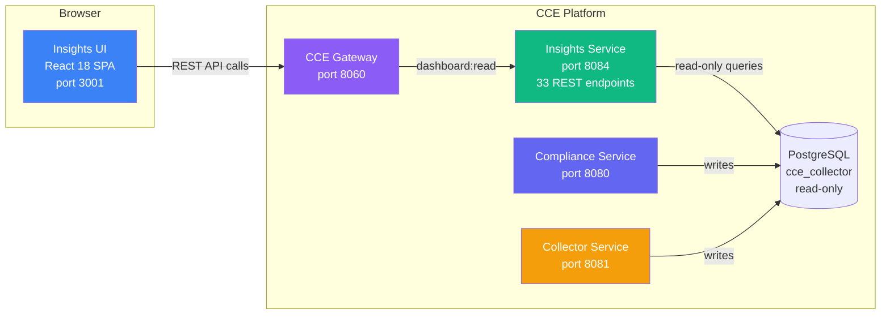
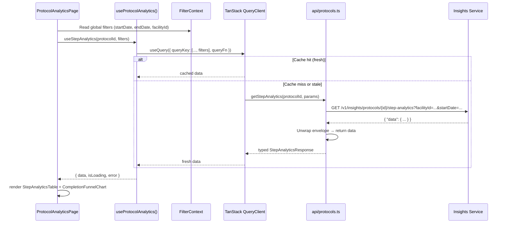
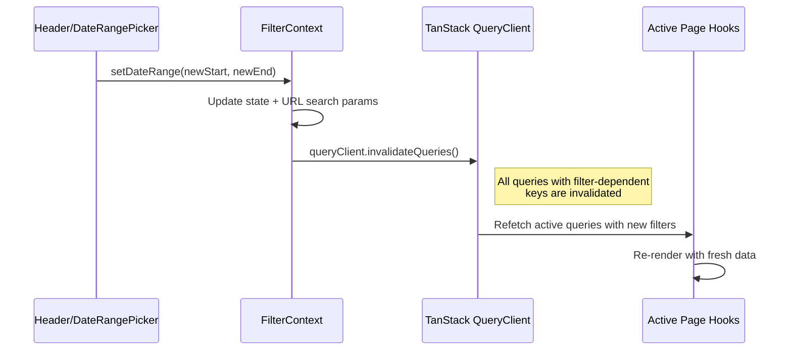

# Architecture Overview

> **CCE Insights UI** — Analytics dashboard for compliance intelligence  
> **Version**: 2.0.0 | **Last Updated**: 2026-06-02

---

## Table of Contents

1. [System Context](#1-system-context)
2. [Technology Stack](#2-technology-stack)
3. [Application Architecture](#3-application-architecture)
4. [Page & Component Hierarchy](#4-page--component-hierarchy)
5. [Data Flow](#5-data-flow)
6. [State Management](#6-state-management)
7. [Routing](#7-routing)
8. [Styling System](#8-styling-system)
9. [Error Handling](#9-error-handling)
10. [Performance](#10-performance)
11. [Deployment](#11-deployment)

---

## 1. System Context

The Insights UI is a **read-only** React SPA that visualizes compliance analytics by consuming the CCE Insights Service REST endpoints. It provides protocol adherence dashboards, deviation trend analysis, event volume metrics, facility leaderboards, practitioner analytics, intelligence delivery monitoring, and ingestion pipeline monitoring. Compliance categories are binary: **Compliant** (`on_track`) and **Non-Compliant** (`non_compliant`).



### Demo Mode Flow (No Gateway)

```
Browser (port 3001) ──REST──▶ Caddy (reverse proxy) ──▶ Insights Service (port 8084) ──▶ PostgreSQL (read-only)
```

In Docker, Caddy serves the SPA and proxies `/v1/insights/*` requests directly to `cce-insights-service:8084` on the shared Docker network.

### Production Flow (With Gateway)

```
Browser (port 3001) ──REST──▶ CCE Gateway (port 8060) ──▶ Insights Service (port 8084) ──▶ PostgreSQL
```

### Relationship to Compliance UI

| Concern | Compliance UI | Insights UI |
|---------|---------------|-------------|
| **Focus** | Individual patient journey demo | Aggregate analytics & operational intelligence |
| **Backend** | Compliance Service (port 8080) | Insights Service (port 8084) |
| **Port** | 3000 | 3001 |
| **Endpoints used** | ~12 (patient-centric) | 40+ (analytics + lookup) |
| **Primary users** | Demo audience, clinical staff | Operations managers, facility supervisors, data analysts |

---

## 2. Technology Stack

| Layer | Technology | Version | Purpose |
|-------|-----------|---------|---------|
| **Framework** | React | 18.x | Component-based UI |
| **Language** | TypeScript | 5.x | Type safety |
| **Build** | Vite | 6.x | Fast dev server, optimized builds |
| **Routing** | React Router | 7.x | Client-side page navigation |
| **Server State** | TanStack Query | 5.x | API data fetching, caching, polling |
| **Styling** | Tailwind CSS | 4.x | Utility-first CSS |
| **Icons** | Heroicons | 2.x | Consistent icon set |
| **Charts** | Recharts | 2.x | Bar, line, area, pie, funnel charts |
| **Dates** | date-fns | 4.x | Date formatting, diff calculation |
| **Testing** | Vitest + Testing Library | latest | Component + hook tests |
| **API Mocking** | MSW | 2.x | Mock Service Worker for tests |
| **Linting** | ESLint + Prettier | latest | Code quality |

### Why These Choices

- **Vite over CRA/Next.js**: SPA with no SSR needs; fastest dev server; minimal config
- **TanStack Query over Redux**: All data is server-owned; built-in polling, caching, stale-while-revalidate; no client mutations
- **Tailwind over component libraries**: Full design control; small bundle; consistent with Compliance UI
- **Recharts over D3**: Sufficient for analytics charts; D3 would be overkill; declarative API matches React patterns

---

## 3. Application Architecture

```mermaid
flowchart TD
    subgraph "Entry"
        main[main.tsx]
        app[App.tsx<br/>QueryClientProvider + Router + FilterProvider]
    end

    subgraph "Pages (13)"
        P1[DashboardPage]
        P2[ComplianceOverviewPage]
        P3[ProtocolAnalyticsPage]
        P4[PatientListPage]
        P5[PatientDetailPage]
        P6[DeviationsPage]
        P7[EventVolumePage]
        P8[SourceComparisonPage]
        P9[FacilityAnalyticsPage]
        P10[PractitionerAnalyticsPage]
        P11[IngestionPage]
        P12[IntelligencePage]
        P13[ExportsPage]
    end

    subgraph "Components"
        direction LR
        L[Layout<br/>Sidebar]
        C[Shared<br/>Card, MetricCard, StatusBadge,<br/>PageHeader, ErrorAlert,<br/>DateRangeFilter, FacilityFilter,<br/>CursorPagination, EmptyState,<br/>LoadingSpinner]
        CH[Charts<br/>10 chart components:<br/>trends, funnels, heatmaps]
    end

    subgraph "Data Layer"
        CTX[Context<br/>FilterContext]
        H[Hooks (13)<br/>useComplianceSummary, useDashboard,<br/>useDeviations, useIntelligence,<br/>usePractitioners, useLookups, etc.]
        A[API Client (14 modules)<br/>compliance, dashboard, deviations,<br/>events, intelligence, practitioners,<br/>ingestion, lookups, etc.]
    end

    subgraph "Utilities"
        U[Utils<br/>dates, colors, formatters,<br/>compliance, pagination]
    end

    main --> app
    app --> L
    app --> CTX
    L --> P1 & P2 & P3 & P4 & P5 & P6 & P7 & P8 & P9 & P10 & P11 & P12 & P13
    P1 & P2 & P3 & P6 & P7 & P9 & P12 --> CH
    P1 & P2 & P3 & P4 & P5 & P6 & P7 & P8 & P9 & P10 & P11 & P12 & P13 --> C
    P1 & P2 & P3 & P4 & P5 & P6 & P7 & P8 & P9 & P10 & P11 & P12 & P13 --> H
    H --> A
    H --> CTX
    CH --> U
    C --> U
```

### Layer Responsibilities

| Layer | Responsibility | Rule |
|-------|---------------|------|
| **Pages** | Route-level components; compose layout + data hooks + child components | One page per route; no direct `fetch` calls |
| **Components** | Visual rendering; receive data via props | Stateless where possible; no API calls |
| **Charts** | Recharts wrappers; receive processed data arrays | No data fetching; pure render |
| **Hooks** | TanStack Query wrappers; return `{ data, isLoading, error }` | One hook per API endpoint group; receive global filters from context |
| **API** | Typed `fetch` wrappers; URL construction, error parsing, envelope unwrapping (14 modules incl. lookups) | No React dependencies; pure TypeScript |
| **Auth** | Token injection via `VITE_AUTH_TOKEN` or `sessionStorage('access_token')` | Enabled when `VITE_AUTH_ENABLED=true`; no Keycloak dependency in demo mode |
| **Context** | Global filter state (date range, facility) shared across pages | Persisted in URL search params for shareability |
| **Utils** | Pure functions for formatting, computation, color mapping | No side effects |

---

## 4. Page & Component Hierarchy

```
App (QueryClientProvider + FilterProvider)
├── AppLayout
│   ├── Sidebar (nav groups: Overview, Compliance, Events, Operations)
│   ├── Header (global date range picker, facility selector)
│   └── <Outlet/> (page content)
│
├── / → DashboardPage
│   ├── MetricCard × 4 (Tracked Cohort, Compliant Care Journeys, Non-Compliant Care Journeys, Active Protocols)
│   ├── Facility/Practitioner summary cards
│   ├── DeviationTrendChart (area — daily)
│   ├── EventVolumeTrendChart (stacked area — by resource type)
│   └── Quick navigation links
│
├── /compliance → ComplianceOverviewPage
│   ├── ProtocolSelector (dropdown)
│   ├── ComplianceSummaryCards (enrollments, compliance rate, deviations)
│   ├── Service Workflow Compliance (vertical timeline with light cards, bold dots, sub-action graph nodes)
│   └── PatientComplianceTable (paginated, Compliant/Non-Compliant filter)
│
├── /compliance/protocols/:id → ProtocolAnalytics
│   ├── StepAnalyticsTable (per-step rates, timeliness, avg/median)
│   ├── CompletionFunnelChart (funnel — drop-off per step)
│   ├── OutcomeDistributionChart (pie — ACTIVE/COMPLETED/WITHDRAWN/EXPIRED)
│   └── EnrollmentTrendChart (line — enrollments over time)
│
├── /compliance/patients → PatientList
│   ├── ComplianceCategoryFilter (on_track / non_compliant)
│   ├── PatientComplianceTable (paginated, filterable)
│   └── RiskHotspotChart (non-compliant hotspots by facility)
│
├── /compliance/patients/:id → PatientDetail
│   ├── ComplianceTimeline (chronological events & steps)
│   ├── ProtocolTrackingCard × N (protocol instances)
│   ├── Protocol Journey (steps with source color-coded pills)
│   ├── StepInstanceTable (step details for selected protocol)
│   └── PatientDeviationList (cross-protocol deviations)
│
├── /deviations → Deviations
│   ├── DeviationTrendChart (area — overdue vs missed over time)
│   ├── DeviationByActionTable (most-deviated steps)
│   ├── ResolutionRateCard (resolved vs escalated)
│   └── DeviationListTable (paginated, filterable)
│
├── /events → EventVolume
│   ├── EventSummaryCards (total, by status)
│   ├── EventTrendChart (stacked area by resource type)
│   ├── ResourceTypeBarChart (bar)
│   ├── FacilityEventTable (events per facility)
│   ├── PractitionerEventTable (events per practitioner)
│   ├── SourceSystemTable (events per source)
│   └── ProcessingQualityChart (MATCHED/ZERO_MATCH/DUPLICATE per source)
│
├── /events/source-comparison → SourceComparison
│   ├── SourceSelector × 2 (sourceA, sourceB dropdowns via useLookups)
│   ├── OverlapSummaryCards (unique, overlapping, percentages)
│   ├── SourceTimelineChart (overlap visualization)
│   └── SamplePairsTable (sample overlapping events)
│
├── /facilities → FacilityAnalytics
│   ├── RankingSelector (by: complianceRate, deviationCount, eventVolume)
│   ├── FacilityRankingTable (color-coded compliance column with legend)
│   └── Non-Compliant Hotspots section
│
├── /practitioners → PractitionerAnalytics
│   ├── Practitioner table with compliance column (color-coded with legend)
│   └── Protocol/Facility filter
│
├── /intelligence → IntelligencePage
│   ├── Total Action Instances metric
│   ├── Donut chart (delivery status)
│   ├── Destinations table + Adaptors table
│   └── Intelligence Actions table
│
├── /ingestion → IngestionPipeline
│   ├── IngestionFunnelChart (ACCEPTED/REJECTED/DUPLICATE)
│   ├── RejectionReasonChart (bar — by rejection reason)
│   ├── SourceQualityTable (per-source acceptance/rejection rates)
│   └── PipelineLossCard (lost events count & rate)
│
└── /exports → Exports
    ├── ExportConfigForm (format, protocol, facility, date range)
    └── DownloadButton
```

---

## 5. Data Flow

### 5.1 API Request Lifecycle



### 5.2 Global Filter Change Flow



### 5.3 Polling for Dashboard Updates

```typescript
useQuery({
  queryKey: ['events', 'summary', filters],
  queryFn: () => getEventSummary(filters),
  refetchInterval: POLLING_INTERVAL, // default 60s
});
```

---

## 6. State Management

| State Type | Tool | Examples |
|-----------|------|---------|
| **Server state** (API data) | TanStack Query | Compliance summaries, deviation trends, event volume |
| **URL state** | React Router + search params | Selected protocol, patient ID, pagination cursor |
| **Filter state** | React Context + URL params | Global date range, facility filter |
| **UI state** | React `useState` | Sidebar collapsed, selected tab, chart dimension |

### Query Key Strategy

```typescript
// Hierarchical keys incorporating global filters for automatic invalidation
['compliance', 'summary', protocolId, { facilityId, startDate, endDate }]
['compliance', 'facility', facilityId, { startDate, endDate }]
['compliance', 'patients', protocolId, { status, facilityId, limit, cursor }]
['patients', patientId, 'timeline', { startDate, endDate }]
['patients', patientId, 'tracking']
['patients', patientId, 'tracking', protocolInstanceId]
['patients', patientId, 'events', { resourceType, source, limit }]
['patients', patientId, 'deviations', { deviationType, startDate, endDate }]
['deviations', 'list', { deviationType, facilityId, protocolDefinitionId, startDate, endDate, sort, limit, cursor }]
['deviations', 'trends', { interval, facilityId, protocolDefinitionId, startDate, endDate }]
['deviations', 'by-action', { protocolDefinitionId, deviationType, facilityId }]
['deviations', 'resolution', { protocolDefinitionId, facilityId, startDate, endDate }]
['intelligence', 'summary']
['events', 'summary', { facilityId, source, startDate, endDate }]
['events', 'trends', { interval, resourceType, facilityId, source, startDate, endDate }]
['events', 'by-resource-type', { facilityId, source, startDate, endDate }]
['events', 'by-facility', { resourceType, startDate, endDate, limit, cursor }]
['events', 'by-practitioner', { facilityId, resourceType, startDate, endDate, limit, cursor }]
['events', 'by-source', { facilityId, startDate, endDate }]
['events', 'source-comparison', { sourceA, sourceB, windowSeconds }]
['events', 'processing-quality', { source, facilityId, startDate, endDate }]
['protocols', protocolId, 'step-analytics', { facilityId, startDate, endDate }]
['protocols', protocolId, 'completion-funnel', { facilityId, startDate, endDate }]
['protocols', protocolId, 'outcome-distribution', { facilityId, startDate, endDate }]
['protocols', protocolId, 'enrollment-trends', { interval, facilityId, startDate, endDate }]
['facilities', 'ranking', { protocolDefinitionId, rankBy, order, limit, cursor }]
['patients', 'at-risk-hotspots', { protocolDefinitionId, startDate, endDate }]
['patients', 'repeat-deviations', { minDeviations, facilityId, protocolDefinitionId }]
['ingestion', 'funnel', { facilityId, source, startDate, endDate, interval }]
['ingestion', 'rejections', { facilityId, source, startDate, endDate }]
['ingestion', 'source-quality', { facilityId, startDate, endDate }]
['ingestion', 'pipeline-loss', { facilityId, startDate, endDate }]
```

---

## 7. Routing

```tsx
// src/App.tsx — uses Routes/Route from react-router-dom with lazy-loaded pages
<Routes>
  <Route path="/" element={<Dashboard />} />
  <Route path="/compliance" element={<ComplianceOverview />} />
  <Route path="/compliance/protocols/:id" element={<ProtocolAnalytics />} />
  <Route path="/compliance/patients" element={<PatientList />} />
  <Route path="/compliance/patients/:id" element={<PatientDetail />} />
  <Route path="/deviations" element={<Deviations />} />
  <Route path="/events" element={<EventVolume />} />
  <Route path="/events/source-comparison" element={<SourceComparison />} />
  <Route path="/facilities" element={<FacilityAnalytics />} />
  <Route path="/practitioners" element={<PractitionerAnalytics />} />
  <Route path="/ingestion" element={<IngestionPipeline />} />
  <Route path="/intelligence" element={<Intelligence />} />
  <Route path="/exports" element={<Exports />} />
</Routes>
```

### Sidebar Navigation

The sidebar uses a flat navigation list (no groups):

```
Dashboard       → /
Compliance      → /compliance
Facilities      → /facilities
Practitioners   → /practitioners
Deviations      → /deviations
Intelligence    → /intelligence
Patients        → /compliance/patients
Events          → /events
Ingestion       → /ingestion
Exports         → /exports
```

Icons from `@heroicons/react`: `ChartBarIcon`, `ClipboardDocumentCheckIcon`, `ExclamationTriangleIcon`, `SignalIcon`, `BuildingOffice2Icon`, `UserGroupIcon`, `CogIcon`, `ArrowDownTrayIcon`, `BoltIcon`.

---

## 8. Styling System

### Compliance Category Palette

| Category | Background | Text | Dot/Icon | Usage |
|----------|-----------|------|----------|-------|
| `on_track` | green-100 | green-700 | green-500 | Badges, table rows, chart segments |
| `non_compliant` | red-100 | red-700 | red-500 | Same |

### Step State Palette

| State | Background | Text | Dot | Tailwind |
|-------|-----------|------|-----|----------|
| `NOT_STARTED` | gray-100 | gray-700 | gray-400 | `bg-gray-100 text-gray-700` |
| `OVERDUE` | amber-100 | amber-700 | amber-500 | `bg-amber-100 text-amber-700` |
| `MISSED` | red-100 | red-700 | red-500 | `bg-red-100 text-red-700` |
| `COMPLETED` | green-100 | green-700 | green-500 | `bg-green-100 text-green-700` |

### Processing Status Palette

| Status | Background | Text | Chart Color |
|--------|-----------|------|-------------|
| `MATCHED` | green-100 | green-700 | `#22c55e` |
| `ZERO_MATCH` | amber-100 | amber-700 | `#f59e0b` |
| `DUPLICATE` | gray-100 | gray-500 | `#9ca3af` |

### Chart Color Scheme

```typescript
export const CHART_COLORS = {
  primary: '#3b82f6',     // blue-500
  secondary: '#10b981',   // emerald-500
  warning: '#f59e0b',     // amber-500
  danger: '#ef4444',      // red-500
  info: '#6366f1',        // indigo-500
  muted: '#9ca3af',       // gray-400
  resourceTypes: ['#3b82f6', '#10b981', '#f59e0b', '#ef4444', '#8b5cf6', '#ec4899', '#14b8a6'],
};
```

---

## 9. Error Handling

### API Error States

| HTTP Status | UI Behavior |
|---|---|
| 400 | Show inline validation error message |
| 404 | Show "Resource not found" empty state |
| 503 | Show "Service unavailable — database may be down" banner |
| 500 | Show "Unexpected error" with retry button |
| Network error | Show "Cannot reach Insights Service" with connection check hint |

### Error Boundary

Wrap the `<Outlet/>` in an error boundary that catches unhandled errors and renders a full-page error state with a "Return to Dashboard" link.

### TanStack Query Error Handling

```typescript
const queryClient = new QueryClient({
  defaultOptions: {
    queries: {
      retry: 2,
      retryDelay: (attempt) => Math.min(1000 * 2 ** attempt, 10000),
      staleTime: 30_000,
      refetchOnWindowFocus: false,
    },
  },
});
```

---

## 10. Performance

| Strategy | Implementation |
|----------|---------------|
| **Stale-while-revalidate** | TanStack Query serves cached data while refetching in background |
| **Polling intervals** | Dashboard: 60s; Detail pages: no auto-refresh (manual refresh button) |
| **Code splitting** | React.lazy + Suspense for page-level components |
| **Chart data memoization** | `useMemo` for expensive chart data transformations |
| **Pagination** | Cursor-based pagination prevents large result sets |
| **Selective fetching** | Each page fetches only the endpoints it needs |

---

## 11. Deployment

### Development

```bash
npm run dev    # Vite dev server at http://localhost:3001
```

### Docker

```dockerfile
FROM node:20-alpine AS build
WORKDIR /app
COPY package*.json ./
RUN npm ci
COPY . .
RUN npm run build

FROM caddy:2-alpine
COPY --from=build /app/dist /srv
COPY Caddyfile /etc/caddy/Caddyfile
EXPOSE 3001
```

### Caddy Configuration

```caddyfile
:3001 {
    encode zstd gzip

    handle /v1/insights/* {
        reverse_proxy cce-insights-service:8084
    }

    handle {
        root * /srv
        @assets path /assets/*
        header @assets Cache-Control "public, max-age=31536000, immutable"
        try_files {path} /index.html
        file_server
    }

    header {
        X-Frame-Options "SAMEORIGIN"
        X-Content-Type-Options "nosniff"
        Referrer-Policy "strict-origin-when-cross-origin"
    }
}
```
